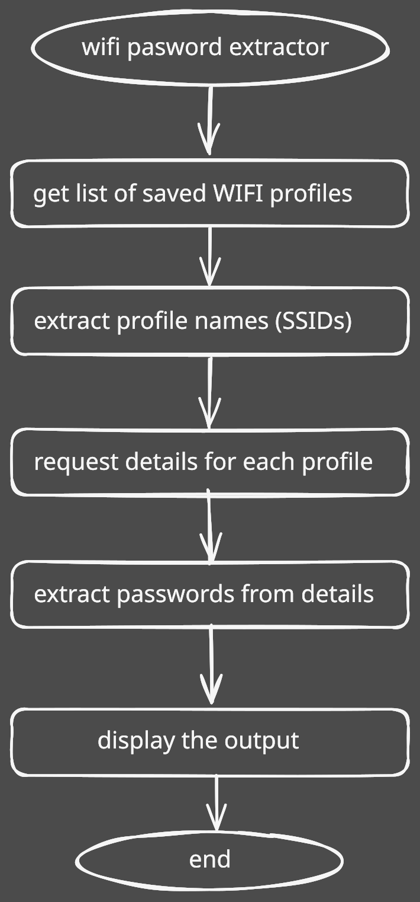

# wifivault

> **Note:** This project is for **personal and educational use only**. Do **not** use it to access networks or devices you don’t own or don’t have explicit permission to access.

<div align="center">

[](https://python.org) [](LICENSE)

</div>

Python script that lists all saved SSIDs and shows their stored passwords.

## 📄How it works

I used the built-in Python module `subprocess` to run `netsh`, the built-in Windows command for managing network settings. The `netsh` command was used to find all saved Wi-Fi profiles on the machine, then parsed the data to extract only the SSIDs. Used again `netsh` to get details for every individual SSID. Parsed the output and extracted passwords. Displayed the output in terminal.

## ⚙️Workflow

<div align="center">
    
</div>

## 🚀Installation

Follow these steps to set up and run the script:

1. **Clone the Repository:**

   ```bash
    git clone https://github.com/cirkovicivan/wifi-password-extractor.git
    cd wifi-password-extractor
   ```

2. **Run the script:**

   ```bash
    python main.py
   ```
